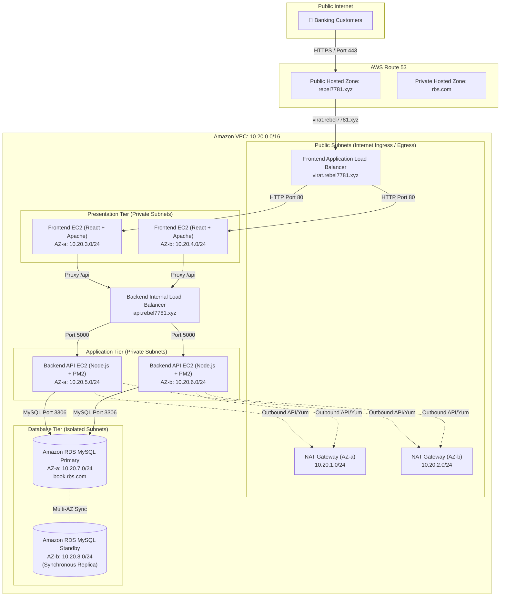

# Enterprise 3-Tier Digital Banking Platform

[](https://github.com/someshtarra/bank_portal)
[](docs/ARCHITECTURE_DECISION_RECORDS.md)
[](docs/PRODUCTION_RUNBOOK_AND_INCIDENT_RESPONSE.md)
[](docs/STANDARD_OPERATING_PROCEDURES.md)
[](docs/ENTERPRISE_TROUBLESHOOTING_GUIDE.md)

An enterprise-grade, high-availability 3-Tier Digital Banking Platform deployed on **Amazon Web Services (AWS)** using multi-AZ fault-tolerant infrastructure. Engineered to support **500,000+ active customer accounts** and process **millions of monthly transactions** with zero-downtime rolling updates, sub-second API latencies, and strict financial audit compliance.

---

## 🏛️ System Architecture

The infrastructure implements a multi-tier, defense-in-depth isolation model within a dedicated Amazon VPC (`10.20.0.0/16`) spanning two Availability Zones (`us-east-1a` and `us-east-1b`).



---

## 🌐 Network Topology & Subnet Specification

| Tier | Availability Zone | Subnet CIDR | Component | Ingress Security Group |
| :--- | :--- | :--- | :--- | :--- |
| **Public Gateway** | `us-east-1a` | `10.20.1.0/24` | Public ALB & NAT Gateway | `sg-alb` (Port 80/443 from `0.0.0.0/0`) |
| **Public Gateway** | `us-east-1b` | `10.20.2.0/24` | Public ALB & NAT Gateway | `sg-alb` (Port 80/443 from `0.0.0.0/0`) |
| **Presentation** | `us-east-1a` | `10.20.3.0/24` | Frontend EC2 (React + Apache) | `sg-frontend` (Port 80/443 from `sg-alb`) |
| **Presentation** | `us-east-1b` | `10.20.4.0/24` | Frontend EC2 (React + Apache) | `sg-frontend` (Port 80/443 from `sg-alb`) |
| **Application** | `us-east-1a` | `10.20.5.0/24` | Backend EC2 (Node.js + PM2) | `sg-backend` (Port 5000 from `sg-frontend`) |
| **Application** | `us-east-1b` | `10.20.6.0/24` | Backend EC2 (Node.js + PM2) | `sg-backend` (Port 5000 from `sg-frontend`) |
| **Database** | `us-east-1a` | `10.20.7.0/24` | RDS MySQL Primary | `sg-database` (Port 3306 from `sg-backend`) |
| **Database** | `us-east-1b` | `10.20.8.0/24` | RDS MySQL Standby | `sg-database` (Port 3306 from `sg-backend`) |

---

## 🔒 Security Architecture & Compliance

The platform enforces enterprise banking security baselines:
* **Defense in Depth**: Every tier is shielded by dedicated VPC Security Groups restricting traffic strictly to necessary ports and security group IDs.
* **Network Isolation**: The Database Tier is placed in isolated private subnets with no internet gateway or NAT route.
* **Least Privilege Access**: EC2 instances run under IAM Instance Profiles with zero static access keys.
* **Data Encryption**:
  * **In-Transit**: TLS 1.3 encryption across all public ALBs and internal reverse proxy hops.
  * **At-Rest**: Storage volumes encrypted via AWS KMS (`aws/rds` & `aws/ebs`).
* **Financial Rule Guards**: Database layer enforces check constraints (`chk_min_balance`) preventing customer account balances from dropping below ₹1,000.

---

## ⚡ Operational Deployment & Zero-Downtime Pipeline

```
[ Developer Commit ] ──► [ GitHub CI Test Pipeline ] ──► [ Artifact Packaging ]
                                                                 │
                                                                 ▼
[ ALB Target Health Pass ] ◄── [ PM2 Reload / ASG Refresh ] ◄── [ EC2 Instance Deployment ]
```

1. **Client Deployment (Presentation Tier)**:
   - React SPA compiled into optimized static assets (`npm run build`).
   - Served via Apache (`httpd`) with HTTP/2 and Gzip/Brotli compression.
   - Apache proxies `/api` endpoints internally to Node.js backend processes.

2. **Backend API Deployment (Application Tier)**:
   - Node.js server managed by **PM2 Cluster Mode** across all CPU cores.
   - Zero-downtime code reloads (`pm2 reload index.js --update-env`).
   - Systemd integration ensures automatic process recovery upon EC2 reboot.

3. **Database Migrations (Database Tier)**:
   - Relational 3NF database schema versioned and deployed via idempotent migration scripts (`backend/test.sql`).

---

## 📚 Internal Engineering Documentation & Runbooks

Comprehensive operational documentation maintained by the DevOps engineering team is available in the [`docs/`](docs/) directory:

* 📐 **[Architecture Decision Records (ADR)](docs/ARCHITECTURE_DECISION_RECORDS.md)**: Architectural choices, trade-offs, and design records (ADR-001 through ADR-010).
* 🛠️ **[Standard Operating Procedures (SOP)](docs/STANDARD_OPERATING_PROCEDURES.md)**: Daily health checks, server provisioning, PM2 recovery, Apache recovery, and database failover runbooks.
* 🔴 **[Enterprise Troubleshooting Guide](docs/ENTERPRISE_TROUBLESHOOTING_GUIDE.md)**: Detailed diagnosis matrices covering 502/504 gateways, DB timeouts, memory leaks, OOM killer, disk space, and NAT failures.
* 🚨 **[Production Runbook & Incident Response](docs/PRODUCTION_RUNBOOK_AND_INCIDENT_RESPONSE.md)**: On-call escalation paths, P1-P4 SLA criteria, Disaster Recovery (RTO/RPO), and Go-Live readiness checklists.

---

## 📂 Repository Layout

```
bank_portal/
├── backend/                  # Application Tier (Node.js REST API)
│   ├── config/               # Database Pool & Environment Configuration
│   ├── controllers/          # Business Logic (Auth, Customer, Admin, Loans)
│   ├── middleware/           # JWT Authentication & Security Headers
│   ├── routes/               # Express API Route Registrations
│   ├── index.js              # Server Entrypoint (PM2 / Systemd)
│   ├── server.js             # Express Application Definition
│   ├── test.sql              # Database 3NF Schema & Seed Definition
│   ├── .env.example          # Environment Variables Template
│   └── package.json
├── client/                   # Presentation Tier (React.js SPA)
│   ├── public/               # Static Web Assets
│   ├── src/                  # React Components, Contexts, & API Layer
│   ├── .env.example
│   ├── package.json
│   └── vite.config.js
├── docs/                     # DevOps & SRE Engineering Documentation
│   ├── ARCHITECTURE_DECISION_RECORDS.md
│   ├── STANDARD_OPERATING_PROCEDURES.md
│   ├── ENTERPRISE_TROUBLESHOOTING_GUIDE.md
│   └── PRODUCTION_RUNBOOK_AND_INCIDENT_RESPONSE.md
└── README.md
```

---

## 💻 Quick Start (Development & Local Verification)

### 1. Application Tier (Backend)
```bash
cd backend
npm install
cp .env.example .env
npm start
```
*Note: If a local MySQL instance is unavailable, the backend automatically boots an embedded in-memory database pre-seeded with test accounts.*

### 2. Presentation Tier (Client)
```bash
cd client
npm install
npm run dev
```
Navigate to `http://localhost:5173` in your browser.

---

## 📊 Capacity Planning & Performance Baseline

* **Target Throughput**: 3,500 Requests Per Second (RPS) at < 45ms median latency.
* **Auto-Scaling Criteria**: ASG expands when average CPU utilization exceeds 60% across 3 consecutive evaluation cycles.
* **Database Connection Pool**: Configured for dynamic connection scaling with 30s connection timeout and automatic health pinging.

---

## 📄 License & Attribution
This repository contains production architecture specifications and code maintained for the Enterprise Digital Banking Platform. Internal Engineering Use Only.
